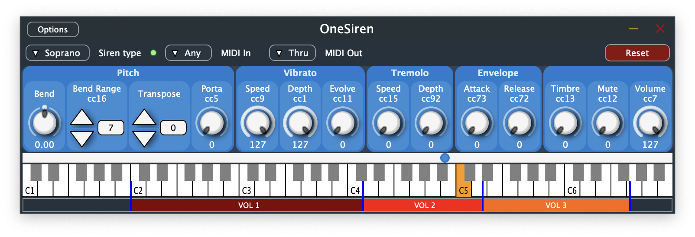
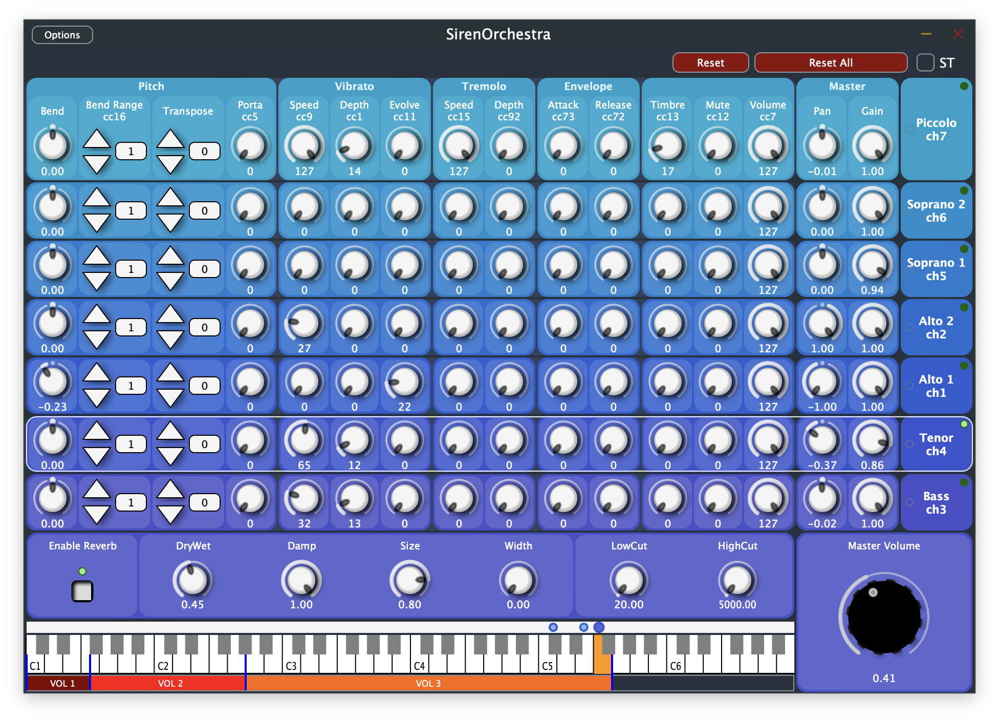

# ComposeSiren

ComposeSiren is a suite of audio and MIDI plugins that synthesize sounds of sirens made by [Mécanique Vivante][1].
The plugins provide automatable parameters from DAW hosts synchronized to MIDI input and output.
They allow to compose pieces for Mécanique Vivante's siren orchestra in studio by simulating them in real-time.
The DAW projects can ultimately be reused to play the pieces on the orchestra during live performances by controlling
the sirens from the DAW's MIDI output.

The orchestra is composed of seven MIDI siren instruments :
- two altos (called S1 and S2),
- a bass (called S3),
- a tenor (called S4),
- two sopranos (called S5 and S6),
- a piccolo (called S7).

There are actually two plugins:
- **OneSiren**, a simple plugin with flexible MIDI routing parameters that can simulate any siren from the orchestra.
  
- **SirenOrchestra**, a plugin that simulates the whole orchestra with its original fixed MIDI routing, and provides
  additional controls such as panning and volume adjustment for each simulated siren, as well as an embedded reverberation module
  and a master volume control.
  

Both are currently available in two formats: VST3 and, on MacOS, Audio Unit. They also exist as Standalone Applications.

The ComposeSiren suite is developed on top of the **JUCE** frameworks. You can find more infos about it there: http://www.juce.com.

On MacOS, the plugins are built as universal (x86_64/arm64) 64 bit VST3, Audio Unit and Standalone Application formats
On windows they are built either as x64 or arm64 VST3 and Standalone Application formats.
They are currently tested on [Reaper][6] and [Ableton Live][4].

### Getting the plugins

Download the latest installer for your OS from the [releases page](https://github.com/mecaviv/ComposeSiren/releases)
and run it. This will install both plugins in VST3 format (as well as Audio Unit format on MacOS), and the corresponding
Standalone Applications.

### Build instructions

The project is based on `CMake`.

In orger to build it, you should have **`CMake 3.22+`**,
a **`C++20`** compiler, and (for optional Resource files processing build step)
**`Python 3`** installed on your system.  
It is also recommended to have `Ninja` installed but you can use `XCode` and
`Visual Studio` generators for MacOS and Windows respectively.

The project consumes a few variables showcased in the template config file `Config.cmake`
(VST2 SDK path and various credentials for software signing)

You can derive your own `MyConfig.cmake` from it, then run the following
commands:
```
$ cmake -B cmake-build-debug -DCMAKE_BUILD_TYPE=<my_build_type> -C MyConfig.cmake
$ cmake --build cmake-build-debug --target <my_target>
```

Example packaging commands for Windows with Visual Studio 2022:
```
$ cmake -B cmake-build-release -G "Visual Studio 17 2022" -C MyConfig.cmake
$ cmake --build cmake-build-release --config Release --target dist
```

#### dependencies

##### linux

`sudo apt-get install libx11-dev libxrandr-dev libxinerama-dev libxcursor-dev libfreetype-dev`

##### Raspberry Pi

```sh
sudo apt install cmake libxrandr-dev libxinerama-dev libxcursor-dev libfreetype6-dev libasound2-dev
```

Resource path is hardcoded to point to `/home/sirenateur/Documents/src/mecaviv/ComposeSiren/Resources/`, so please checkout the repository in `/home/sirenateur/Documents/src/mecaviv/`:

```shell
cd ~/Documents
mkdir src
cd src
mkdir mecaviv
cd mecaviv
git clone https://github.com/mecaviv/ComposeSiren.git
```

##### git tips

* first clone the repository with the `--recursive` option to fetch JUCE
  submodule, or run `git submodule update --init` after cloning.
* if at some point the `Dependencies/JUCE` submodule is altered by some IDE, you
  can reset it using `git submodule deinit -f .` then `git submodule update --init`

At the moment the plugin is built :

* on Mac OS 13.7.8 using Ninja (Xcode works too)
  * `cmake -B build -G Ninja -C MyConfig.cmake -DCMAKE_BUILD_TYPE=Release` to setup the build system
  * `cmake --build build --config Release` to build the plugins and generate the installer
* on Windows 11 (Windows 10 compatible) using Visual Studio (Ninja works too)
  * `cmake -B build -G "Visual Studio 17 2022" -C MyConfig.cmake`
  * `cmake --build build --config Release --target dist`
* on Linux or Raspberry
  * `cmake -B builds/linux -G "Unix Makefiles"`
  * `cmake --build builds/linux --config Release`
  * no instruction for installer for now

The resulting installer (built with `productbuild` on mac and `NSIS` on windows)
is created in `build/Packaging/ComposeSiren_Installer_artefacts`

NB :
* download VS 2022 Community from [HERE](https://aka.ms/vs/17/release/vs_community.exe)
  (more dl links [HERE](https://sharethis.zip/visual_studio/))

[1]: https://mecanique-vivante.com/en/instrumental-exploration/
[2]: https://minhaskamal.github.io/DownGit/#/home?url=https://github.com/patriceguyot/ComposeSiren/tree/master/Builds/MacOSX/ComposeSiren.vst3
[3]: https://help.ableton.com/hc/en-us/sections/202295165-Plug-Ins
[4]: https://www.ableton.com/en/live/
[5]: https://minhaskamal.github.io/DownGit/#/home?url=https://github.com/patriceguyot/ComposeSiren/tree/master/Builds/MacOSX/ComposeSiren.component
[6]: https://www.reaper.fm/
