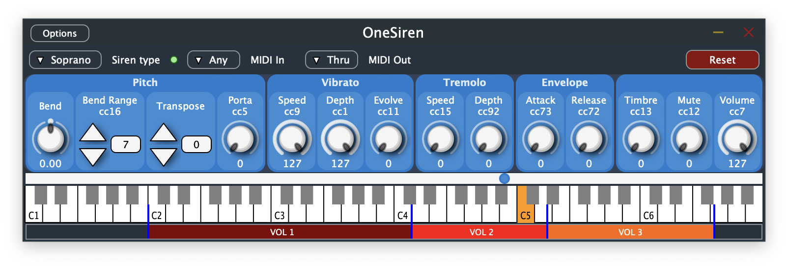
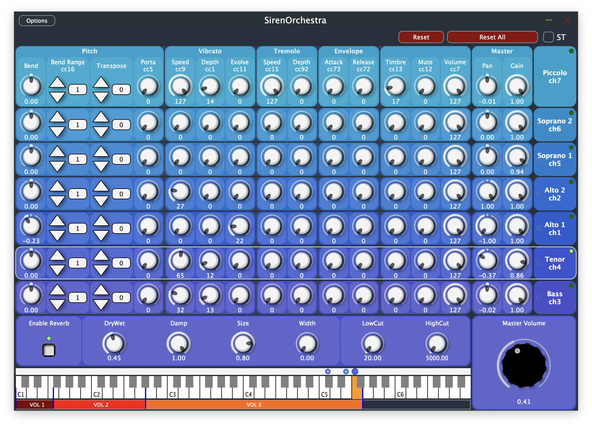

# ComposeSiren

**ComposeSiren** is a suite of 2 audio and MIDI virtual instrument plugins that synthesize sounds of musical sirens
made by [Mécanique Vivante][1].
Each plugin provides a set of parameters automatable from DAW hosts and synchronized to its MIDI input and output.
Together, they allow to compose pieces for Mécanique Vivante's siren orchestra in studio by replicating their
behaviour : the CC and Pitchwheel messages mirror the MIDI control parameters of the real sirens, and their physical
properties and sound are simulated in real-time from actual captured data.
The DAW projects can ultimately be reused to play the pieces on the orchestra during live performances by controlling
the sirens from the DAW's MIDI output.

The orchestra is composed of 7 MIDI sirens :
- two altos (S1 and S2),
- a bass (S3),
- a tenor (S4),
- two sopranos (S5 and S6),
- a piccolo (S7).

### OneSiren

A simple plugin with flexible MIDI routing parameters that can simulate any siren from the orchestra.


### SirenOrchestra

A plugin that simulates the whole orchestra with its original fixed MIDI routing, and provides additional controls
such as panning and volume adjustment for each simulated siren, as well as an embedded reverberation module and a master
volume control.


On MacOS, the plugins are available as universal (x86_64/arm64) 64 bit VST3, Audio Unit and Standalone Application
formats. On windows they are available as x64 VST3 and Standalone Application formats.
They are currently tested on [Reaper][6] and [Ableton Live][4].

The ComposeSiren suite is developed on top of the **JUCE** frameworks. You can find more infos about it there: http://www.juce.com.

## Getting the plugins

Download the latest installer for your OS from the [releases page](https://github.com/mecaviv/ComposeSiren/releases)
and run it. This will install both plugins in the formats available on your platform, and a bunch of shared resource
files required for the simulation.

## Build instructions

The project is based on `CMake`.

In order to build it, you should have **`CMake 3.22+`**,
a **`C++20`** compiler, and (for optional Resource files processing build step)
**`Python 3`** installed on your system.  
It is also recommended to have `Ninja` but you can use `XCode` and
`Visual Studio` generators for MacOS and Windows respectively.
You will also need `NSIS` for Windows installer generation.

The project consumes a few variables listed in the template config file `Config.cmake`
(VST2 SDK path and various credentials for software signing)

You can derive your own `MyConfig.cmake` file from it, then run the following
commands:
```
$ cmake -B <my_cmake_build_dir> -DCMAKE_BUILD_TYPE=<my_build_type> -C MyConfig.cmake
$ cmake --build <my_cmake_build_dir> --target <my_target>
```

Example packaging commands for MacOS with XCode:
```
$ cmake -B cmake-build-release -DCMAKE_BUILD_TYPE=RELEASE -C MyConfig.cmake
$ cmake --build cmake-build-RELEASE --target dist
```

Example packaging commands for Windows with Visual Studio 2022:
```
$ cmake -B cmake-build-release -G "Visual Studio 17 2022" -C MyConfig.cmake
$ cmake --build cmake-build-release --config Release --target dist
```

The resulting installer (built with `productbuild` on mac and `NSIS` on windows)
is created in `build/Packaging/ComposeSiren_Installer_artefacts`

### Park bridge

The park UDP bridge is off by default. `-DCOMPOSESIREN_PARK_BRIDGE=ON`
compiles it and shows the "Sirenes physiques" and "ST" controls on
SirenOrchestra. With the default (`OFF`), bridge code and controls are omitted.

The default implementation is `SirenLink` (C++). An optional Rust backend can
be selected with `-DCOMPOSESIREN_MECAVIV_BRIDGE=ON`; it requires separately
supplied integration dependencies. This backend option has no effect when
the park bridge is off. See `Source/ComposeSirenCore/MecavivBridge.cmake`
for its build configuration.

```
$ cmake -B cmake-build-debug -DCMAKE_BUILD_TYPE=Debug -DCOMPOSESIREN_PARK_BRIDGE=ON
$ cmake --build cmake-build-debug --target SirenOrchestra_VST3
```

### MCP server

Each plugin instance can run an in-process MCP server so an assistant can set
parameters, send MIDI, and (in the standalone) choose audio and MIDI devices.
It is on by default (`-DCOMPOSESIREN_MCP=ON`). It does not use the park bridge
or any sibling checkout. Turn it off with `-DCOMPOSESIREN_MCP=OFF`.

- The crate lives in `Source/composesiren-mcp`.
- `Source/mcp-discovery` is the generic part, for any MCP server of the mecaviv projects: the
  discovery file (`Registry`: read, register and unregister under a file lock, the running
  instances) and a blocking client (feature `client`). It knows no application: it takes the
  file's name.
- `Source/composesiren-mcp-api` is what the server and its clients agree on, on top of it: the
  tools' names, their arguments and replies, and which file is ComposeSiren's
  (`~/.composesiren_mcp.json`). The server builds its tools from those types, and a test
  checks that the tools it offers are the ones the crate declares. A client in another
  application depends on it by path.
- Both depend on nothing outside this repository, so the MCP server still builds without any
  sibling checkout. Another MCP server of the projects uses `mcp-discovery` the same way:
  its own discovery file name, its own API crate.
- A running instance writes `~/.composesiren_mcp.json` with `pluginName`,
  `plugin4CC`, `port`, `pid`, `sessionId`, and `standalone`.
- Streamable HTTP is at `http://127.0.0.1:<port>/mcp`. The first port tried is
  13720.
- You need a Rust toolchain when MCP is ON. A universal macOS build needs
  both `aarch64-apple-darwin` and `x86_64-apple-darwin`, the same as the
  park bridge. See `Source/ComposeSirenCore/Mcp.cmake`.

```
$ cmake -B cmake-build-debug -DCMAKE_BUILD_TYPE=Debug
$ cmake --build cmake-build-debug --target OneSiren_Standalone
```

### Recorder

SirenOrchestra can record its audio output, after the reverb, to FLAC (24-bit)
or WAV (24-bit, or 32-bit float). It is off by default; turn it on with
`-DCOMPOSESIREN_RECORD=ON`.

- **Dialog:** a Record... button in the top row opens it. It has the format,
  the file (by default `~/Music/ComposeSiren/ComposeSiren-<date>-<time>.flac`),
  start and stop, and the duration and any dropped frames.
  - **Fade out** (on by default): Stop lets the sound ring on and ends the
    file itself. It ends as soon as the output has stayed under -60 dBFS for
    a quarter second. If it still sounds after 2 s (a drone, a note left on),
    it fades out over 3 s. The button reads "Fading out..." until then.
    Unticked, Stop cuts at once.
- **MCP tools** (with `COMPOSESIREN_MCP`): `start_recording` (optional `path`,
  and `format`: `flac`, `wav` or `wav-float`), `stop_recording`, and
  `recording_status`.
  - `stop_recording` takes `fade` (default false: cut at once), and with it
    `wait_seconds` (2) and `fade_seconds` (3). It returns at once. Poll
    `recording_status`, which reports `fading`, until `recording` is false.
- **The crate:** `Source/composesiren-record`, pure Rust (`flacenc`, `hound`),
  with no JUCE, so it also works for the DSP outside the plugin.
  - The audio thread only copies each block into a lock-free ring buffer.
  - A writer thread encodes and writes the file.
  - A recording cut short (a crash) still decodes up to its last complete
    FLAC frame.
- **Rust:** it needs a toolchain like the MCP server. See
  `Source/ComposeSirenCore/Record.cmake`.

```
$ cmake -B cmake-build-debug -DCMAKE_BUILD_TYPE=Debug -DCOMPOSESIREN_RECORD=ON
$ cmake --build cmake-build-debug --target SirenOrchestra_Standalone
```

### Click output

SirenOrchestra can play the park's click (the click box's metronome) on a
second stereo output bus, **Clic**, separate from the sirens. It is off by
default; turn it on with `-DCOMPOSESIREN_CLIC=ON`.

- **MIDI, channel 10**, the click box's rule: a note on with note > 1 and
  velocity > 1 plays the strong click if the note is even, the weak click if
  it is odd; a program change picks the click (0 = the original click,
  1 = a clave). Each click starts at its sample position in the block.
- **The bus:** stereo, or disabled by the host. The recorder records it too
  (it records every output channel).
- **Build dependencies:** this optional integration requires separately supplied
  dependencies. See `Source/ComposeSirenCore/Clic.cmake` for its build
  configuration.

```
$ cmake -B cmake-build-debug -DCMAKE_BUILD_TYPE=Debug -DCOMPOSESIREN_CLIC=ON
$ cmake --build cmake-build-debug --target SirenOrchestra_Standalone
```

### dependencies

#### linux

```sh
sudo apt-get install libx11-dev libxrandr-dev libxinerama-dev libxcursor-dev libfreetype-dev
```

#### Raspberry Pi

```sh
sudo apt install cmake libxrandr-dev libxinerama-dev libxcursor-dev libfreetype6-dev libasound2-dev
```

Resource path is hardcoded to point to `/home/sirenateur/Documents/src/mecaviv/ComposeSiren/Resources/`, so please checkout the repository in `/home/sirenateur/Documents/src/mecaviv/`:

```shell
cd ~/Documents
mkdir src
cd src
mkdir mecaviv
cd mecaviv
git clone https://github.com/mecaviv/ComposeSiren.git
```

### git tips

* first clone the repository with the `--recursive` option to fetch JUCE
  submodule, or run `git submodule update --init` after cloning.
* if at some point the `Dependencies/JUCE` submodule is altered by some IDE, you
  can reset it using `git submodule deinit -f .` then `git submodule update --init`

### NB :
* download VS 2022 Community from [HERE](https://aka.ms/vs/17/release/vs_community.exe)
* more dl links (MSBuildTools, VS versions) [HERE](https://sharethis.zip/visual_studio/)

[1]: https://mecanique-vivante.com/en/instrumental-exploration/
[2]: https://minhaskamal.github.io/DownGit/#/home?url=https://github.com/patriceguyot/ComposeSiren/tree/master/Builds/MacOSX/ComposeSiren.vst3
[3]: https://help.ableton.com/hc/en-us/sections/202295165-Plug-Ins
[4]: https://www.ableton.com/en/live/
[5]: https://minhaskamal.github.io/DownGit/#/home?url=https://github.com/patriceguyot/ComposeSiren/tree/master/Builds/MacOSX/ComposeSiren.component
[6]: https://www.reaper.fm/
