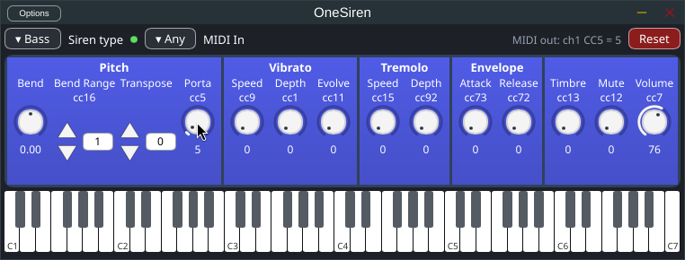
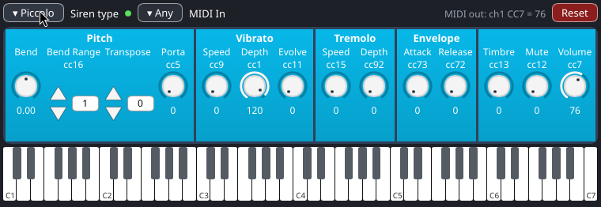
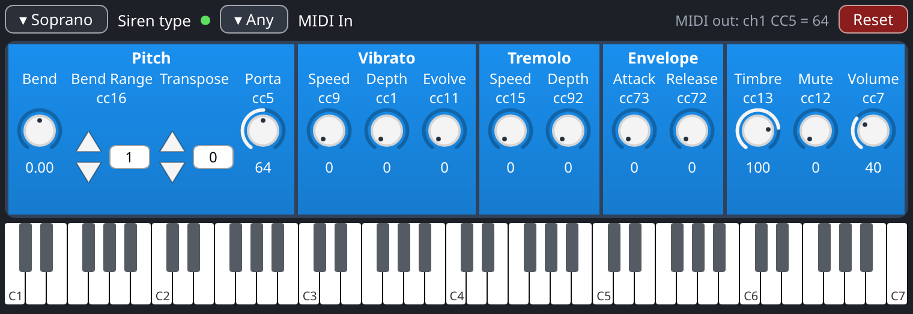

# Porting the ComposeSiren UI to Slint: investigation and proof of concept

October 2026. The scope is **the UI only**. JUCE keeps the audio engine,
the parameters (`AudioProcessorValueTreeState`), MIDI routing, the plugin formats (VST3, AU, Standalone)
and the window. The UI layer is written in Rust with [Slint](https://slint.dev) and drawn inside the JUCE
editor. Nothing changes in the default build: the Slint editor sits behind a new CMake option,
`COMPOSESIREN_SLINT_UI`, which is **OFF** by default, and the existing options are untouched.

## TL;DR

- **It works, inside the real plugin.** OneSiren's editor (strip, header, keyboard) is reimplemented in
  `.slint` plus Rust, about 1,900 lines including the tests and the JUCE bridge. With
  `-DCOMPOSESIREN_SLINT_UI=ON`, the JUCE OneSiren Standalone and VST3 build on Linux. The Standalone ran
  with the Slint editor: knob drags, the mouse wheel and the siren type all went through the APVTS and
  `VoiceManagerState`.
  - Slint's software renderer draws it straight into a `juce::Image` owned by an ordinary
    `juce::AudioProcessorEditor`, which forwards its mouse events to Slint.
  - There is no second native window, no OpenGL context, and no event loop of Slint's own.
- **Parameters keep JUCE's semantics.** Each strip parameter has a `juce::ParameterAttachment` (gestures,
  host notification, undo-free like today). Host, automation and MIDI-input values reach the UI through a
  lock-free Rust store, polled at frame rate.
- **The bridge is a C ABI.** It is built as a Rust staticlib with the repo's existing
  `composesiren_add_rust_staticlib` (Corrosion on Linux/Windows, cargo + lipo on macOS), with a
  cbindgen-generated committed header, exactly like `composesiren-record` or `composesiren-mcp`. The C++
  side is one header-only editor class (`SlintOneSirenEditor.h`, about 150 lines).
- **Full-port effort:** about 6 to 9 weeks for one developer for OneSiren + SirenOrchestra at visual parity,
  host testing included (see the [estimate](#effort-estimate-for-a-full-ui-port)).
- **Recommendation:** go on with this architecture (option A below), port OneSiren completely first, ship it
  behind the option, and test it in the target hosts before starting on SirenOrchestra.

## What the current UI is

All of it is JUCE components, about 6,000 lines in `Source/ComposeSirenCore/Components` and
`Source/Plugins/*/PluginEditor.*`, plus about 400 lines of dialogs (Settings, Record).

| Part | Where | Notes |
|---|---|---|
| Look and feel | `LookAndFeels.h` (1,332 lines) | `KnobLAF`, `CentredKnobLAF`, `NotchedKnobLAF`, `IncDecLAF`, `ToggleLAF`, `HeaderSwitchLAF`, combo box and keyboard LAFs. Most of the visual identity lives here. |
| Building blocks | `SliderCell`, `ToggleCell`, `GuiCell(Group)`, `EngravedTitle` | A label + control cell bound with `SliderAttachment`; titled groups with gradient boxes. |
| OneSiren (754x200) | `PluginEditor`, `MainButtonsComponent`, `VoiceManagerComponent`, `SirenStripComponent`, `DbRangesMidiKeyboardComponent` | Menu / Reset / resources buttons; siren type and MIDI in/out; the 14-parameter strip in 5 groups; keyboard coloured by the siren's dB ranges. |
| SirenOrchestra | `PluginEditor`, 7 x `SirenTrackComponent`, `ReverbStripComponent`, `MasterVolumeComponent`, `AboutDialog`, `ClicPane` | One compact strip per siren with pan/gain, ST LEDs refreshed at 4 Hz, reverb (7 parameters), master volume, keyboard. |
| Dialogs | `SettingsDialog`, `RecordDialog` | Behind `COMPOSESIREN_SETTINGS` and `COMPOSESIREN_RECORD`. |
| State glue | `VoiceManagerState` (+ listeners), APVTS ids `"<group> \| <codeName>"`, for example `S5 \| Volume` | |

Strip parameters (`parameterDefinitions.h`) and the MIDI each mirrors: PitchBend (pitch wheel),
PitchBendRange 1..36 (CC16), Transpose -24..24 (UI only), Portamento (CC5), Vibrato speed/depth/evolve
(CC9/CC1/CC11), Tremolo speed/depth (CC15/CC92), Attack/Release (CC73/CC72), Timbre (CC13), Mute (CC12),
Volume (CC7, default 127). The strip colour is the HSL ramp `sirenColourById`, from `#4650c8` to `#00b4c8`.

Porting is mostly **re-expressing the look-and-feel classes and component layouts declaratively**. There is
little UI logic: values, ranges and CC numbers come from the parameter definitions.

## Architecture options (JUCE stays for audio and hosting)

### A. Slint renders into the JUCE editor (software renderer, C ABI): **chosen, implemented in the PoC**

```
 host ── JUCE plugin (VST3/AU/Standalone) ─────────────────────────────────────────────
         AudioProcessor + APVTS + SirenVoice (C++, unchanged)
         SlintOneSirenEditor : juce::AudioProcessorEditor        (C++, ~150 lines)
           ├─ ParameterAttachment x14 ──► cs_slint_ui_set_param ──► ParamStore (atomics)
           ├─ Timer 60 Hz ──► cs_slint_ui_tick(pixels) ──► Slint software renderer
           ├─ paint(): drawImage(pixels)                     ▲
           └─ mouse*/wheel ──► cs_slint_ui_pointer/wheel ────┘   libcomposesiren_slint_ui.a (Rust)
                ◄── callbacks: param_changed / gesture / category_changed / note
```

- **For:**
  - No native child window: no host focus or z-order quirks, and nothing platform-specific in our code.
    The same code path works for VST3, AU and Standalone on macOS, Windows and Linux.
  - The plugin carries no GPU context, so it can't conflict with the host's GL, Metal or D2D.
  - Pixel-exact headless rendering, used by the tests and the PNG example.
  - Fits the repo's existing Rust staticlib pattern.
- **Against:**
  - CPU rendering. Slint redraws only when something changed, and a full frame of this editor is far below
    a millisecond, but large editors at 2x scale (SirenOrchestra) should be measured.
  - Keyboard and text input have to be forwarded too: the PoC forwards mouse and wheel only.
  - The display scale is fixed at creation in the PoC. Moving the window between a 1x and a 2x screen needs
    re-creating the pixel buffer on a scale change.

### B. JUCE editor hosting a Slint child window (GPU)

Slint gets its own native child window, parented to `getWindowHandle()` (for example through
[slint-baseview](https://codeberg.org/RustAudio/slint-baseview), `SlintWindow::open_parented`, OpenGL/FemtoVG).
- **For:** GPU rendering, and Slint's own text input and IME.
- **Against:**
  - A second native window inside a host's window: focus, keyboard routing, resize and DPI change are
    exactly where plugin UIs break, and they break per host and per OS.
  - The plugin carries an OpenGL context (deprecated on macOS).
  - `slint-baseview` is a git dependency, not on crates.io yet.

Keep it as a fallback if A's CPU cost shows up on SirenOrchestra at 2x.

### C. Slint's C++ API inside JUCE

The same rendering choices as A or B, but the UI logic would be C++. Not chosen: the requested direction is
Rust for the UI layer. The model, store, MIDI mapping and bindings are in Rust and tested with `cargo test`.

### Not for now: a full Rust plugin (nice-plug + nice-plug-slint)

[nice-plug](https://codeberg.org/RustAudio/nice-plug), the community continuation of nih-plug, has an
official Slint adapter in progress on top of slint-baseview. Going that way would mean porting the audio
engine (Sirene, SirenVoice, MIDI routing, reverb), the Standalone app and the AU path out of JUCE: a much
bigger change, and explicitly out of scope. Option A keeps that door open, because the UI crate does not
depend on JUCE. `HostSink` and `ParamStore` would map onto nice-plug's `ParamSetter` / `Params`.

## The proof of concept

### Layout

```
Source/composesiren-slint-ui/
  Cargo.toml              standalone package (own [workspace]), staticlib + rlib, edition 2024
  build.rs                slint-build (ui/*.slint → Rust) + cbindgen (src/ffi.rs → include/)
  ui/widgets.slint        Knob (arcs, pointer, drag/wheel/double-click reset), Spin, Group, Pill
  ui/onesiren.slint       OneSiren: header, the strip from a [ParamRow] model, keyboard C1..C7
  src/params.rs           the 14 parameters (ranges, steps, defaults, CCs, groups), categories, colour ramp
  src/store.rs            ParamStore: one AtomicU32 per parameter + host-change mask (lock-free)
  src/midi.rs             the CC / pitch-wheel message a value mirrors (shown as "MIDI out")
  src/editor.rs           binds the component to the store; HostSink gets edits + gestures
  src/embed.rs            custom Slint Platform + MinimalSoftwareWindow → host BGRA pixels, input forwarding
  src/ffi.rs              C ABI (cs_slint_ui_*), header committed in include/composesiren_slint_ui.h
  src/bin/onesiren_slint.rs  standalone preview window with a simulated host (feature `standalone`)
  examples/render_png.rs  headless render through the plugin path, before/after a drag
  tests/                  model, MIDI, store; embedded render + drag with gestures
  SlintUi.cmake           composesiren_add_rust_staticlib for the crate
Source/Plugins/OneSiren/SlintOneSirenEditor.h   the JUCE editor using the C ABI (next to PluginEditor.h)
```

Wiring outside the crate is small and opt-in:
- `CMakeLists.txt`: `composesiren_option(COMPOSESIREN_SLINT_UI … OFF)`, recorded in the build info like the
  other options.
- `Source/CMakeLists.txt`: OneSiren only. It links `composesiren_slint_ui` and defines
  `COMPOSESIREN_SLINT_UI=1`; every other plugin target gets `COMPOSESIREN_SLINT_UI=0`.
- `Plugins/OneSiren/PluginProcessor.cpp`: `createEditor()` returns `SlintOneSirenEditor` under
  `#if COMPOSESIREN_SLINT_UI`.

### Data flow

- **UI to host:**
  - A knob drag goes to the Slint `param-changed(index, raw)` callback.
  - Rust snaps the value to the parameter's step and range (`ParamDef::constrain`), stores it, and updates
    the row text.
  - It then calls `HostSink::param_changed` → `ParameterAttachment::setValueAsPartOfGesture`, with
    `gesture(begin/end)` around it (pointer down/up, double-click reset, wheel step).
- **Host to UI:**
  - The attachment callback calls `cs_slint_ui_set_param`, which writes the atomic and sets the parameter's
    bit in the change mask.
  - A 16 ms Slint timer takes the mask and refreshes only those rows.
  - The store is lock-free, so a host thread could write it directly too: the standalone `--automate` does
    exactly that from a second thread.
- **Siren type:** the menu goes to `VoiceManagerState::setSirenCategory(…, true)`, as the JUCE menu does. The
  listener calls `cs_slint_ui_set_category`, which does not report back, so there is no loop. The strip
  colour follows the same ramp as `sirenColourById`.
- **Keyboard:** notes go to `juce::MidiKeyboardState` on channel 1.

### Build and run

The crate needs Rust **1.92** (Slint 1.18's minimum; the other crates need 1.88).

```sh
cd Source/composesiren-slint-ui
cargo test                                                  # model, MIDI, store, embedded render + drag
cargo run --features standalone --bin onesiren-slint        # preview window, prints what the host gets
cargo run --features standalone --bin onesiren-slint -- --automate   # + host automation on Vibrato Depth
cargo run --example render_png -- /tmp/shots 2              # headless PNGs through the plugin path, 2x
cargo clippy --all-targets [--features standalone]          # clean under the repo's pedantic lints
```

In the plugin:

```sh
cmake -S . -B build -G Ninja -DCMAKE_BUILD_TYPE=Release -DCOMPOSESIREN_SLINT_UI=ON
cmake --build build --target OneSiren_Standalone OneSiren_VST3
```

The default configuration (option OFF) builds exactly what it built before.

### Status

| Check | Result |
|---|---|
| `cargo build` / `cargo test` (6 tests) / `cargo clippy` pedantic, both feature sets | pass (Linux, rustc 1.99) |
| Standalone preview window (winit, X11) | runs; knob drags print gestures, values and the CC; siren type recolours; `--automate` moves Depth live |
| Headless render through the embedded path, 1x and 2x | pass; drag on Portamento → 64, host Volume 40 / Timbre 100 shown |
| Plugin build with `-DCOMPOSESIREN_SLINT_UI=ON` (Linux, GCC 14, Ninja, Release) | OneSiren_Standalone + OneSiren_VST3 build and link (see [build notes](#plugin-build-notes)) |
| JUCE OneSiren Standalone with the Slint editor (X11) | runs. Volume drag → 76, wheel on Portamento → 5, siren type → Bass through `VoiceManagerState` (strip recoloured); the header shows the mirrored CC |
| Default build, option OFF | OneSiren_Standalone builds; no Slint symbols in the binary |
| macOS (rustc 1.98.1): `cargo test`, headless render at 2x, `--features standalone` build | pass (crate only; the window was not opened) |
| macOS / Windows plugin builds, DAW host testing | not done |

Size: the Release `libcomposesiren_slint_ui.a` is about 50 MB, but the linker drops most of it. The
unstripped Linux OneSiren Standalone is 38.4 MB with the option ON and 23.0 MB with it OFF, so about
+15 MB unstripped; the stripped difference still needs to be measured on macOS.

#### Plugin build notes

The box (Debian 13, GCC 14) needed two flags that have **nothing to do with Slint**. Upstream fails the same
way on that toolchain: the code is normally built with Apple clang, whose headers include more
transitively.
- `Sirene.cpp` uses `memset` without `<cstring>`, and `SirenVoice.h` / `SirenEnsemble.h` use `std::atomic`
  without `<atomic>`. Worked around with `-DCMAKE_CXX_FLAGS="-include atomic -include cstring"`.
- `std::atomic` of a non-lock-free struct (for example in `PerSirenMidiBridges`) needs libatomic. Worked
  around with `-DCMAKE_CXX_STANDARD_LIBRARIES=-latomic`.

The proper fix is two `#include`s and a `target_link_libraries(... atomic)` on Linux. I left it out of this
change to keep its diff UI-only. Also needed on Debian: the JUCE dev packages (ALSA, FreeType, fontconfig,
X11 headers) plus `cmake ninja-build g++`.

On macOS no extra flags should be needed. Corrosion is not used there: the helper runs cargo per
architecture plus lipo, and `SlintUi.cmake` adds the CoreText/CoreGraphics/CoreFoundation frameworks.

### What the PoC does not do yet

- **Look and feel:**
  - Knob, spin box and group visuals are close to, but not exactly, the JUCE ones: notched knobs, header
    switches, the engraved titles and the grey strip theme are missing.
  - There is no dB-range colouring on the keyboard.
- **Controls:** the siren type is a cycling button instead of a pop-up menu, and the MIDI in/out choosers,
  the Menu (Settings, Record) and the resources button are missing.
- **Input:** keyboard input is not forwarded (no text fields yet), and HiDPI scale changes after creation
  are not handled.
- SirenOrchestra is not started.

## Effort estimate for a full UI port

One developer who knows the codebase; days are working days.

| Work | Days |
|---|---|
| Harden the bridge: keyboard/focus forwarding, scale changes, resize, cursor shape, `juce::ParameterAttachment` for bool/choice parameters, a ref-counted platform across instances, error paths | 3 - 5 |
| Widget library at LAF parity: knob variants (centred, notched), inc/dec, toggles, header switches, combo/pop-up menus, engraved titles, theme colours | 4 - 6 |
| OneSiren complete: main buttons + menu, voice manager (type, MIDI in/out), strip, dB-range keyboard, state monitor | 4 - 6 |
| SirenOrchestra: 7 track strips (compact), pan/gain, ST LEDs, reverb strip, master, keyboard, About, Clic pane, song title bar | 7 - 10 |
| Dialogs (Settings from the metadata, Record): **keep them as JUCE windows** at first (0), or port | 0 / 4 - 6 |
| Build and packaging: macOS universal (lipo path exists), Windows (Corrosion), CI, binary size check | 2 - 4 |
| Host testing (Live, Reaper, Bitwig, Logic/AU, Standalone; 1x/2x; multiple instances) and fixes | 4 - 6 |
| Visual review with users, polish | 3 - 5 |
| **Total** | **27 - 42** (about 6 - 9 weeks), +4 - 6 if the dialogs are ported |

Doing OneSiren first, behind the option, gets most of the risk out of the way in about the first 3 weeks.

## Risks

- **Slint's platform is process-global.** All editors of one plugin binary share it, on JUCE's message
  thread. That is fine because JUCE creates editors there, but plugin binaries can't share it (each one links
  its own Slint, which is fine too). The PoC installs the platform once and hands each editor its own window.
- **The software rendering cost on large editors at 2x** has to be measured on SirenOrchestra. Fallback:
  option B for that editor only.
- **Text input and IME** need keyboard forwarding (JUCE `keyPressed` → Slint `KeyPressed`/`KeyReleased`).
  This matters for any text field and for the song title.
- **AU on macOS** has never been tried with this setup. VST3 and Standalone use the same editor code, so the
  risk is low, but it needs testing.
- **Toolchain:** Slint 1.18 needs Rust 1.92. CI and developer machines need a recent stable toolchain.
- **Two UI stacks during the transition** (JUCE LAF plus Slint), until the old editors are removed.

## Licensing

| Component | Licence | Note |
|---|---|---|
| ComposeSiren | GPLv3 | |
| JUCE 8.0.12 (submodule `501c076`) | AGPLv3 or commercial JUCE 8 licence | Already the case today, not introduced by Slint. GPLv3 section 13 allows combining with AGPLv3 code; the AGPL's network clause then applies to the JUCE parts. Worth knowing because the plugins run an MCP server (`COMPOSESIREN_MCP`). |
| Slint 1.18 | GPL-3.0-only OR Royalty-free 2.0 OR commercial | Use it under GPLv3, matching ComposeSiren. The royalty-free licence also allows desktop apps, but requires attribution ("Made with Slint"). |
| VST3 SDK (bundled in JUCE) | MIT (Steinberg, 2025) | |
| nice-plug, slint-baseview (not used) | ISC / MIT-style | Only for the future options B/C. |

This is not legal advice. It is a summary of the licence texts to check with the project's maintainers.

## Next steps

1. Review the PoC visually against the JUCE editor; agree on the widget look (or a refreshed one).
2. Bridge hardening: keyboard forwarding, scale changes, a pop-up menu widget; build the plugin with the
   option on macOS (arm64 + universal) and Windows; open it in two or three hosts.
3. Port the rest of OneSiren to parity; run it with the option on for a while.
4. Measure the 2x rendering cost on a SirenOrchestra prototype (7 strips), then port SirenOrchestra.
5. Decide whether to keep Settings/Record as JUCE dialogs or port them.
6. When both editors are at parity, consider flipping `COMPOSESIREN_SLINT_UI` to ON, and later remove the
   JUCE components.

## Screenshots

The JUCE OneSiren Standalone built with `-DCOMPOSESIREN_SLINT_UI=ON` (JUCE window, Slint editor). The
screenshot is after a Volume drag, five wheel steps on Portamento, and a click on the siren type (Alto →
Bass, through `VoiceManagerState`).



The Rust standalone preview (`--automate`): after a drag on Volume (76) and picking Piccolo; Vibrato Depth moved
by the simulated host; the header shows the CC the drag mirrors.



The embedded path the plugin uses, rendered headless at 2x: after a pointer drag on Portamento (64) and
host changes on Timbre (100) and Volume (40).


